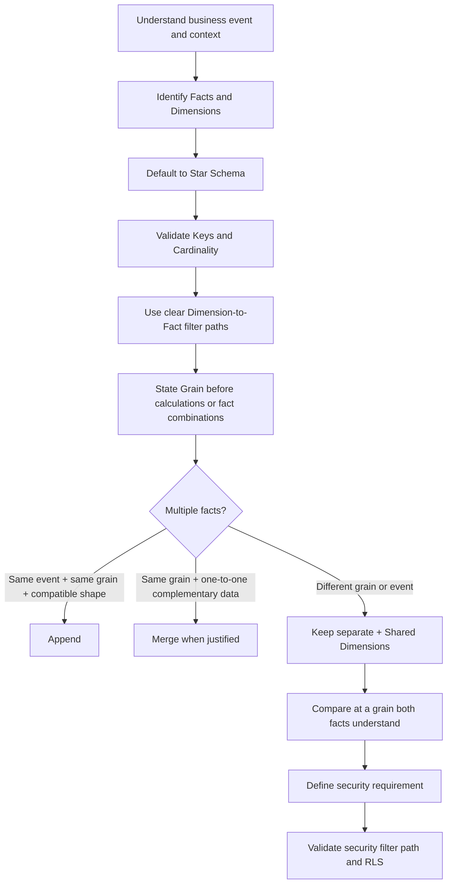

# Dimensional Data Modeling Portfolio

> Evidence-driven learning portfolio for dimensional data modeling: from modeling fundamentals and relationship semantics to the redesign and validation of a complex analytical model.

## Project status

**Theory phase complete — ready to start the guided Nightmare hands-on project.**

Current progress:

- ✅ Lesson 1 — Modeling foundations; facts vs dimensions
- ✅ Lesson 2 — Star, snowflake and galaxy schemas
- ✅ Lesson 3 — Relationships, cardinality, filter direction and ambiguity
- ✅ Lesson 4 — Special dimensions: extracted, junk and role-playing dimensions
- ✅ Lesson 5 — Grain
- ✅ Lesson 6 — Multiple fact tables
- ✅ Lesson 7 — Security and Row-Level Security
- ▶ Guided Nightmare portfolio project — ready to start
- ⬜ Independent no-tutorial model audit
- ⬜ Final validation and recruiter-ready evidence

The seven theory lessons were marked complete only after the corresponding course segments had been watched and checked through Active Recall. Practical Power BI implementation claims are intentionally deferred until the Nightmare project is actually built and validated.

## Objective

This repository documents dimensional data modeling skills for analytics and data engineering, with emphasis on the semantic and structural layer underneath reporting:

- business-oriented table design
- fact and dimension modeling
- grain definition
- keys and cardinality
- relationship design
- filter propagation
- star, snowflake and galaxy schemas
- special dimension patterns
- multiple-fact modeling
- data quality and reconciliation
- semantic measures
- row-level security
- modeling decisions and trade-offs

The capstone will redesign a deliberately messy multi-table analytical model into a validated dimensional model and document the reasoning and verification behind the redesign.

## Evidence model

```text
Concept
→ Explain from memory
→ Implement
→ Validate
→ Debug
→ Document
→ Evidence
```

The repository separates three evidence levels:

1. **Course-derived concepts** — paraphrased and organized in original documentation.
2. **Guided implementation** — the Data with Baraa Nightmare case study reproduced hands-on.
3. **Independent evidence** — validation, model audit, trade-off analysis and no-tutorial reconstruction.

## Theory curriculum — completed

The complete pre-project theory block is documented in [`docs/theory/`](docs/theory/README.md).

| Lesson | Topic | Status |
|---|---|---|
| [01](docs/theory/lesson_01_modeling_foundations.md) | Modeling foundations; flat-table and one-report anti-patterns; facts and dimensions | ✅ Completed |
| [02](docs/theory/lesson_02_schema_patterns.md) | Star, snowflake and galaxy schemas | ✅ Completed |
| [03](docs/theory/lesson_03_relationships.md) | Merge vs relationship, cardinality, filtering, ambiguity, active/inactive relationships | ✅ Completed |
| [04](docs/theory/lesson_04_special_dimensions.md) | Extracted dimensions, junk dimensions, role-playing dimensions | ✅ Completed |
| [05](docs/theory/lesson_05_grain.md) | Table grain, measure grain and grain-aware aggregation | ✅ Completed |
| [06](docs/theory/lesson_06_multiple_facts.md) | Append vs merge, shared dimensions, fan-out and common comparison grain | ✅ Completed |
| [07](docs/theory/lesson_07_security_rls.md) | Table/column/row security; static and dynamic RLS | ✅ Completed |

Repository-native visual summaries are available in [`diagrams/`](diagrams/README.md).

## Core modeling decision map



## Completed theory checkpoints

### Relationships

- `Bidirectional filtering` is not the same as `ambiguity`.
- Ambiguity means multiple active filter paths exist between parts of the model.
- An inactive relationship can be semantically valid; it is simply not the default filter path.
- Multiple date roles do not imply many-to-many cardinality; one `dim_date` can have active/inactive `1:*` role relationships to a fact.

### Special dimensions

- descriptive context embedded in a fact should be reviewed for extraction;
- junk dimensions bundle suitable low-level flags / descriptive attributes;
- role-playing dimensions allow one entity to serve multiple roles against the same fact;
- `USERELATIONSHIP()` can intentionally use an inactive alternative relationship for a calculation.

### Grain

The core question is: **What does exactly one row represent?**

- Order grain is coarser than Order-Line grain.
- Table grain and measure/column grain can differ.
- A higher-grain value repeated over lower-grain rows can be double counted by a naive aggregation.
- Grain must be understood before aggregation, relationships or fact combination.

### Multiple facts

- same event + same grain + compatible structure → **Append**;
- same grain + one-to-one complementary data → **Merge when justified**;
- different grain/event → keep facts separate and connect through shared dimensions;
- cross-fact comparisons must occur at a grain both facts understand.

### Security / RLS

The course distinguishes **table-level, column-level and row-level security**. RLS is the focus of the hands-on security section.

- Static RLS uses fixed role/filter rules and is suitable for smaller scenarios.
- Dynamic RLS maps users to permitted business values through a security table.
- `USERPRINCIPALNAME()` identifies the current report user; the role then filters the security mapping rather than magically filtering every fact directly.
- Correct relationships and filter direction are security-critical because the security filter must propagate from the security table into the analytical model.
- RLS must be tested with representative roles/users and expected restricted totals.
- Report filters answer **what the user wants to analyze**; RLS defines **what the user is allowed to see at all**.

## Next phase — Nightmare hands-on project

The next implementation step is the guided Nightmare project. The repository will now move from theory evidence to actual model evidence:

```text
Inspect source model
→ record baseline metrics
→ define grain
→ identify facts and dimensions
→ build dimensions
→ build facts
→ establish relationships
→ validate filter behavior
→ add date / role-playing dimensions
→ define measures
→ implement RLS
→ reconcile metrics
→ final validation
→ independent no-tutorial audit
```

See [`PROJECT_PLAN.md`](PROJECT_PLAN.md) and Issue #6 for the implementation checklist.

## Claim boundaries

The theory phase is complete, but the capstone is not yet implemented. This repository therefore demonstrates structured conceptual understanding and recall, not production Power BI experience. Implementation claims will be added only when corresponding model artifacts and validation evidence exist.

## Attribution

The course structure, guided case study and source dataset are based on **Data with Baraa**. See [`SOURCES.md`](SOURCES.md). Course material is not presented as independently invented; the repository adds original learning notes, diagrams, implementation evidence, validation, decision records and independent reflection.

## License

Code and original documentation in this repository are covered by the repository license. Third-party course material and source datasets remain subject to their original authors' terms.