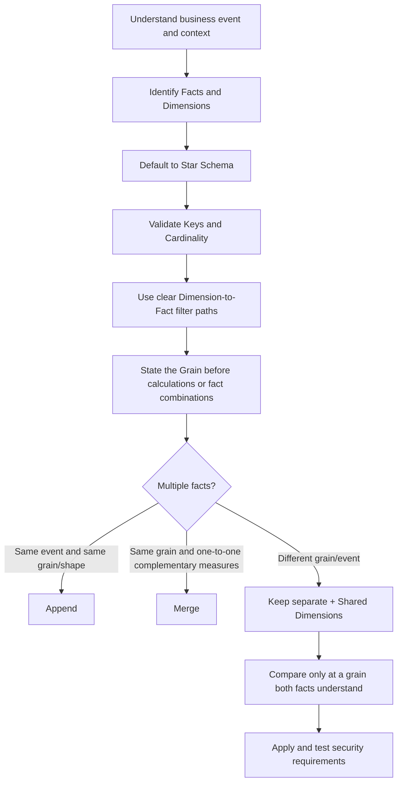
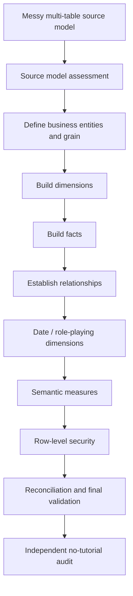

# Dimensional Data Modeling Portfolio

> Evidence-driven learning portfolio for dimensional data modeling: from modeling fundamentals and relationship semantics to the redesign and validation of a complex analytical model.

## Project status

**In progress — the complete theory reference is documented; guided capstone not started yet.**

Current learning progress is tracked separately from documentation status:

- ✅ Lesson 1 — Modeling foundations; facts vs dimensions
- ✅ Lesson 2 — Star, snowflake and galaxy schemas
- 🟡 Lesson 3 — Relationships, cardinality, filter direction and ambiguity
- ⬜ Lesson 4 — Special dimensions: extracted, junk and role-playing dimensions
- ⬜ Lesson 5 — Grain
- ⬜ Lesson 6 — Multiple fact tables
- ⬜ Lesson 7 — Security and Row-Level Security
- ⬜ Guided Nightmare portfolio project
- ⬜ Independent no-tutorial model audit
- ⬜ Final validation and recruiter-ready evidence

> **Documentation complete does not mean skill complete.** Lessons 4–7 are documented ahead from the course transcript but remain uncompleted learning checkpoints until they have been watched, explained from memory and tested through Active Recall.

## Objective

This repository documents my hands-on development of dimensional data modeling skills for analytics and data engineering.

The target is not dashboard design. The target is the semantic and structural layer underneath analytics:

- business-oriented table design
- fact and dimension modeling
- grain definition
- keys and cardinality
- relationship design
- filter propagation
- star, snowflake and galaxy schemas
- special dimension patterns
- multiple-fact modeling
- data quality and reconciliation
- semantic measures
- row-level security
- modeling decisions and trade-offs

The final capstone will rebuild a deliberately messy multi-table analytical model into a validated dimensional model and document the reasoning and verification behind the redesign.

## Why this repository exists

A completed course is weak evidence on its own. This repository converts learning into inspectable artifacts:

```text
Concept → Explain → Implement → Validate → Debug → Document → Evidence
```

The project separates three evidence levels:

1. **Course-derived concepts** — paraphrased and organized in original documentation.
2. **Guided implementation** — the Data with Baraa Nightmare case study reproduced hands-on.
3. **Independent evidence** — validation, model audit, trade-off analysis and no-tutorial reconstruction.

## Complete theory curriculum

The full theory block of the Data with Baraa course is documented in [`docs/theory/`](docs/theory/README.md). The lesson split follows the sequence and topic transitions in the transcript.

| Lesson | Topic | Learning status |
|---|---|---|
| [01](docs/theory/lesson_01_modeling_foundations.md) | Modeling foundations; flat-table and one-report anti-patterns; facts and dimensions | ✅ Completed |
| [02](docs/theory/lesson_02_schema_patterns.md) | Star, snowflake and galaxy schemas | ✅ Completed |
| [03](docs/theory/lesson_03_relationships.md) | Merge vs relationship, cardinality, filtering, ambiguity, active/inactive relationships | 🟡 In progress |
| [04](docs/theory/lesson_04_special_dimensions.md) | Dimensions hidden in facts, junk dimensions, role-playing dimensions | ⬜ Not yet studied |
| [05](docs/theory/lesson_05_grain.md) | Table grain, measure grain and grain-aware aggregation | ⬜ Not yet studied |
| [06](docs/theory/lesson_06_multiple_facts.md) | Append vs merge, shared dimensions, fan-out and common comparison grain | ⬜ Not yet studied |
| [07](docs/theory/lesson_07_security_rls.md) | Table/column/row security; static and dynamic RLS | ⬜ Not yet studied |

The guided Nightmare project begins after this theory block. Practical Power BI artifacts will be added only when that project is implemented.

## Theory decision map



## Core modeling principles documented from the course

- Facts capture business events / activities; dimensions provide descriptive analytical context.
- A star schema is the default analytical pattern in the course.
- Dimension keys on the `1` side should be unique for standard `1:*` star-schema relationships.
- Filters should normally propagate **Dimension → Fact**.
- Bidirectional filters require deliberate justification because they can create unintended propagation and ambiguity.
- Direct fact-to-fact relationships are avoided; shared dimensions connect multiple facts.
- Grain must be stated before aggregating, merging, appending or relating fact tables.
- A numeric column can exist at a different grain from the fact table and can therefore be double-counted if aggregated blindly.
- Same-event partitioned facts can be appended; compatible one-to-one facts can be merged; different-grain facts remain separate and use shared dimensions.
- Measures from different facts should be compared only at a level of detail both facts actually support.
- Security depends on valid model relationships and filter propagation and must be tested against known results.

## Repository map

```text
.
├── README.md
├── PROJECT_PLAN.md
├── SOURCES.md
├── model/
│   └── README.md
├── diagrams/
│   ├── README.md
│   ├── lesson-01-foundations.md
│   ├── lesson-02-schema-patterns.md
│   └── lesson-03-relationships.md
├── docs/
│   ├── theory/
│   │   ├── README.md
│   │   ├── lesson_01_modeling_foundations.md
│   │   ├── lesson_02_schema_patterns.md
│   │   ├── lesson_03_relationships.md
│   │   ├── lesson_04_special_dimensions.md
│   │   ├── lesson_05_grain.md
│   │   ├── lesson_06_multiple_facts.md
│   │   └── lesson_07_security_rls.md
│   ├── 01_modeling_fundamentals.md
│   ├── 02_schema_patterns.md
│   ├── 03_relationships.md
│   ├── 04_source_model_assessment.md
│   ├── 05_grain_analysis.md
│   ├── 06_dimensions.md
│   ├── 07_facts.md
│   ├── 08_semantic_measures.md
│   ├── 09_security.md
│   ├── 10_architecture_decisions.md
│   └── 11_lessons_learned.md
├── tests/
│   ├── README.md
│   ├── baseline_metrics.md
│   ├── relationship_validation.md
│   ├── reconciliation_tests.md
│   └── final_validation.md
├── screenshots/
│   └── README.md
└── learning/
    ├── active_recall.md
    └── confusion_log.md
```

The root `docs/01...11` files are the evidence/project documentation track. Files for later project stages are intentionally present as **templates** and do not claim that the capstone has already been implemented.

## Evidence standards

A modeling claim is only considered complete when it has corresponding evidence. Depending on the claim, that evidence may include:

- model diagram
- Power BI model screenshot
- explicit grain statement
- uniqueness/cardinality check
- relationship validation
- baseline metric comparison
- reconciliation test
- RLS test case
- architecture decision record
- documented failure and fix

## Planned capstone flow



## Claim boundaries

Until the capstone is implemented and validated, this repository should be read as **learning-in-progress evidence**, not as proof of production Power BI experience.

The theory files demonstrate structured source-based documentation. Implementation claims will be added only when the corresponding Power BI model artifacts and validation results exist.

## Attribution

The guided case study and source dataset are based on the **Data with Baraa** Data Modeling course and portfolio project. See [SOURCES.md](SOURCES.md).

The implementation will be reproduced hands-on and extended with my own documentation, validation evidence, architecture decisions, model audits, diagrams and learning reflections.

## License

Code and original documentation in this repository are covered by the repository license. Third-party course material and source datasets remain subject to their original authors' terms.