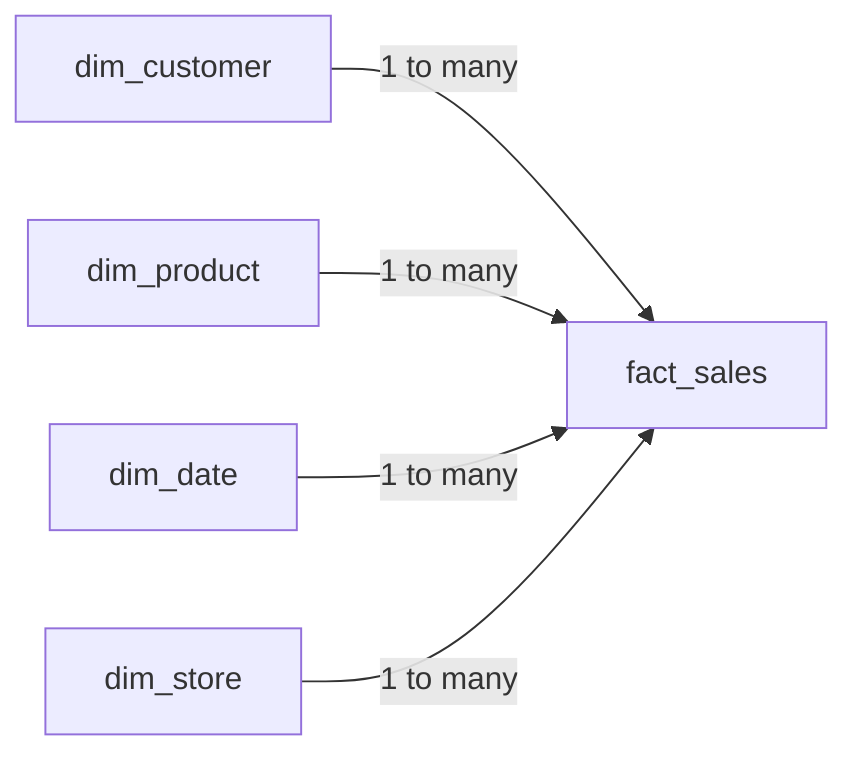
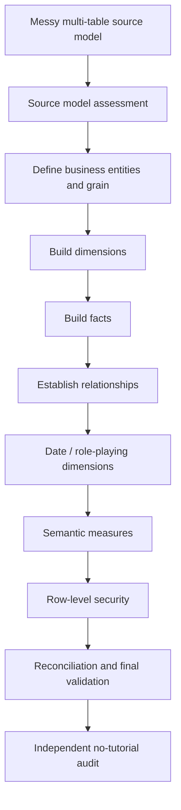

# Dimensional Data Modeling Portfolio

> Evidence-driven learning portfolio for dimensional data modeling: from modeling fundamentals and relationship semantics to the redesign and validation of a complex analytical model.

## Project status

**In progress — foundations documented; guided capstone not started yet.**

Current learning progress:

- ✅ Lesson 1 — Why data modeling matters; facts vs. dimensions
- ✅ Lesson 2 — Star, snowflake and galaxy schemas
- 🟡 Lesson 3 — Relationships, cardinality, filter direction and ambiguity
- ⬜ Grain and advanced modeling patterns
- ⬜ Guided 23-table portfolio project
- ⬜ Independent no-tutorial model audit
- ⬜ Final validation and recruiter-ready evidence

## Objective

This repository documents my hands-on development of dimensional data modeling skills for analytics and data engineering.

The target is not dashboard design. The target is the semantic and structural layer underneath analytics:

- business-oriented table design
- fact and dimension modeling
- grain definition
- keys and cardinality
- relationship design
- filter propagation
- star, snowflake and galaxy schemas
- data quality and reconciliation
- semantic measures
- row-level security
- modeling decisions and trade-offs

The final capstone will rebuild a deliberately messy multi-table analytical model into a validated dimensional model and document the reasoning and verification behind the redesign.

## Why this repository exists

A completed course is weak evidence on its own. This repository converts learning into inspectable artifacts:

```text
Concept → Explain → Implement → Validate → Debug → Document → Evidence
```

The project therefore separates three things:

1. **Course-derived concepts** — documented in my own words.
2. **Guided implementation** — the Data with Baraa case study reproduced hands-on.
3. **Independent evidence** — validation, model audit, trade-off analysis and no-tutorial reconstruction.

## Current model principles

The first three lessons establish the following working model:



Core rules documented so far:

- Facts capture business events / activities and numeric values.
- Dimensions provide descriptive context for filtering and grouping.
- A star schema is the default analytical pattern in the course.
- Filters should normally propagate **Dimension → Fact**.
- Dimension keys on the `1` side must be unique.
- Direct fact-to-fact relationships are avoided; shared dimensions connect multiple facts.
- Many-to-many relationships require deliberate modeling and should not be accepted casually.
- Multiple active filter paths can create ambiguity and incorrect results.

## Repository map

```text
.
├── README.md
├── PROJECT_PLAN.md
├── SOURCES.md
├── model/
│   └── README.md
├── diagrams/
│   ├── README.md
│   ├── lesson-01-foundations.md
│   ├── lesson-02-schema-patterns.md
│   └── lesson-03-relationships.md
├── docs/
│   ├── 01_modeling_fundamentals.md
│   ├── 02_schema_patterns.md
│   ├── 03_relationships.md
│   ├── 04_source_model_assessment.md
│   ├── 05_grain_analysis.md
│   ├── 06_dimensions.md
│   ├── 07_facts.md
│   ├── 08_semantic_measures.md
│   ├── 09_security.md
│   ├── 10_architecture_decisions.md
│   └── 11_lessons_learned.md
├── tests/
│   ├── README.md
│   ├── baseline_metrics.md
│   ├── relationship_validation.md
│   ├── reconciliation_tests.md
│   └── final_validation.md
├── screenshots/
│   └── README.md
└── learning/
    ├── active_recall.md
    └── confusion_log.md
```

Files for later project stages are intentionally present as **templates**. They do not claim that the capstone has already been implemented.

## Evidence standards

A modeling claim is only considered complete when it has corresponding evidence. Depending on the claim, that evidence may include:

- model diagram
- Power BI model screenshot
- explicit grain statement
- uniqueness/cardinality check
- relationship validation
- baseline metric comparison
- reconciliation test
- RLS test case
- architecture decision record
- documented failure and fix

## Planned capstone flow



## Claim boundaries

Until the capstone is implemented and validated, this repository should be read as **learning-in-progress evidence**, not as proof of production Power BI experience.

The current evidence demonstrates structured understanding of the documented modeling concepts. Implementation claims will be added only when the corresponding model artifacts and validation results exist.

## Attribution

The guided case study and source dataset are based on the **Data with Baraa** Data Modeling course and portfolio project. See [SOURCES.md](SOURCES.md).

The implementation will be reproduced hands-on and extended with my own documentation, validation evidence, architecture decisions, model audits, diagrams and learning reflections.

## License

Code and original documentation in this repository are covered by the repository license. Third-party course material and source datasets remain subject to their original authors' terms.