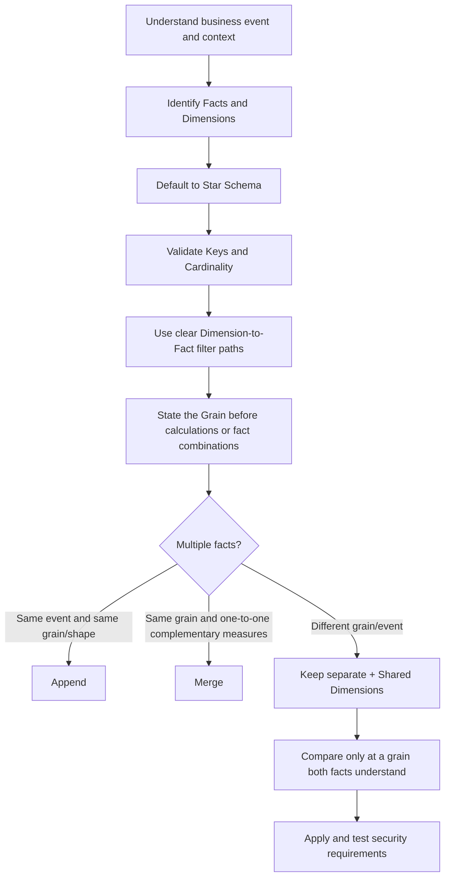

# Dimensional Data Modeling Portfolio

> Evidence-driven learning portfolio for dimensional data modeling: from modeling fundamentals and relationship semantics to the redesign and validation of a complex analytical model.

## Project status

**In progress — the complete theory reference is documented; guided capstone not started yet.**

Current learning progress is tracked separately from documentation status:

- ✅ Lesson 1 — Modeling foundations; facts vs dimensions
- ✅ Lesson 2 — Star, snowflake and galaxy schemas
- ✅ Lesson 3 — Relationships, cardinality, filter direction and ambiguity
- ✅ Lesson 4 — Special dimensions: extracted, junk and role-playing dimensions
- ✅ Lesson 5 — Grain
- ✅ Lesson 6 — Multiple fact tables
- ▶ Lesson 7 — Security and Row-Level Security
- ⬜ Guided Nightmare portfolio project
- ⬜ Independent no-tutorial model audit
- ⬜ Final validation and recruiter-ready evidence

> **Documentation complete does not mean skill complete.** Lessons are marked complete only after the relevant video block has been watched, explained from memory and checked through Active Recall.

## Objective

This repository documents my hands-on development of dimensional data modeling skills for analytics and data engineering.

The target is not dashboard design. The target is the semantic and structural layer underneath analytics:

- business-oriented table design
- fact and dimension modeling
- grain definition
- keys and cardinality
- relationship design
- filter propagation
- star, snowflake and galaxy schemas
- special dimension patterns
- multiple-fact modeling
- data quality and reconciliation
- semantic measures
- row-level security
- modeling decisions and trade-offs

The final capstone will rebuild a deliberately messy multi-table analytical model into a validated dimensional model and document the reasoning and verification behind the redesign.

## Why this repository exists

A completed course is weak evidence on its own. This repository converts learning into inspectable artifacts:

```text
Concept → Explain → Implement → Validate → Debug → Document → Evidence
```

The project separates three evidence levels:

1. **Course-derived concepts** — paraphrased and organized in original documentation.
2. **Guided implementation** — the Data with Baraa Nightmare case study reproduced hands-on.
3. **Independent evidence** — validation, model audit, trade-off analysis and no-tutorial reconstruction.

## Complete theory curriculum

The full theory block of the Data with Baraa course is documented in [`docs/theory/`](docs/theory/README.md). The lesson split follows the sequence and topic transitions in the transcript.

| Lesson | Topic | Learning status |
|---|---|---|
| [01](docs/theory/lesson_01_modeling_foundations.md) | Modeling foundations; flat-table and one-report anti-patterns; facts and dimensions | ✅ Completed |
| [02](docs/theory/lesson_02_schema_patterns.md) | Star, snowflake and galaxy schemas | ✅ Completed |
| [03](docs/theory/lesson_03_relationships.md) | Merge vs relationship, cardinality, filtering, ambiguity, active/inactive relationships | ✅ Completed |
| [04](docs/theory/lesson_04_special_dimensions.md) | Dimensions hidden in facts, junk dimensions, role-playing dimensions | ✅ Completed |
| [05](docs/theory/lesson_05_grain.md) | Table grain, measure grain and grain-aware aggregation | ✅ Completed |
| [06](docs/theory/lesson_06_multiple_facts.md) | Append vs merge, shared dimensions, fan-out and common comparison grain | ✅ Completed |
| [07](docs/theory/lesson_07_security_rls.md) | Table/column/row security; static and dynamic RLS | ▶ Current |

The guided Nightmare project begins after this theory block. Practical Power BI artifacts will be added only when that project is implemented.

## Theory decision map



## Completed learning checkpoints

### Lesson 3 — Relationships

The following distinctions were explicitly corrected and re-tested:

- `Bidirectional filtering` is not the same as `ambiguity`.
- Ambiguity means multiple active filter paths exist between parts of the model.
- An inactive relationship can be semantically valid; it is simply not the default filter path.
- Multiple date roles such as `order_date` and `ship_date` do **not** imply many-to-many cardinality. A unique `dim_date` remains on the `1` side and the fact remains on the `*` side.

### Lesson 4 — Special Dimensions

The completed checkpoint includes identifying dimension-like context embedded in facts, junk dimensions, role-playing dimensions, active/inactive role relationships and the conceptual purpose of `USERELATIONSHIP()`.

### Lesson 5 — Grain

The checkpoint established the core working question: **What does exactly one row represent?**

Key distinctions validated through recall:

- Order grain is coarser than Order-Line grain.
- A table can be at Order-Line grain while a repeated measure such as `order_total` is semantically at Order grain.
- Blindly summing a coarser-grain measure repeated across finer-grain rows causes double counting.
- Grain must therefore be established before aggregation, relationship design or combining facts.

### Lesson 6 — Multiple Facts

The checkpoint established the course decision logic:

- same business event + same grain + compatible shape → **Append**;
- same grain + one-to-one complementary attributes/measures → **Merge** when justified;
- different grain or different business events → keep facts separate and model through shared dimensions;
- comparisons between facts must occur at a grain both facts understand.

Example validated in recall: daily Sales can be aggregated to Month and compared with monthly Budget; monthly Budget cannot be interpreted at Day grain without an additional allocation assumption.

## Claim boundaries

Until the capstone is implemented and validated, this repository should be read as **learning-in-progress evidence**, not as proof of production Power BI experience.

The current evidence demonstrates structured understanding of the documented modeling concepts. Implementation claims will be added only when the corresponding model artifacts and validation results exist.

## Attribution

The guided case study and source dataset are based on the **Data with Baraa** Data Modeling course and portfolio project. See [SOURCES.md](SOURCES.md).

The implementation will be reproduced hands-on and extended with my own documentation, validation evidence, architecture decisions, model audits, diagrams and learning reflections.

## License

Code and original documentation in this repository are covered by the repository license. Third-party course material and source datasets remain subject to their original authors' terms.