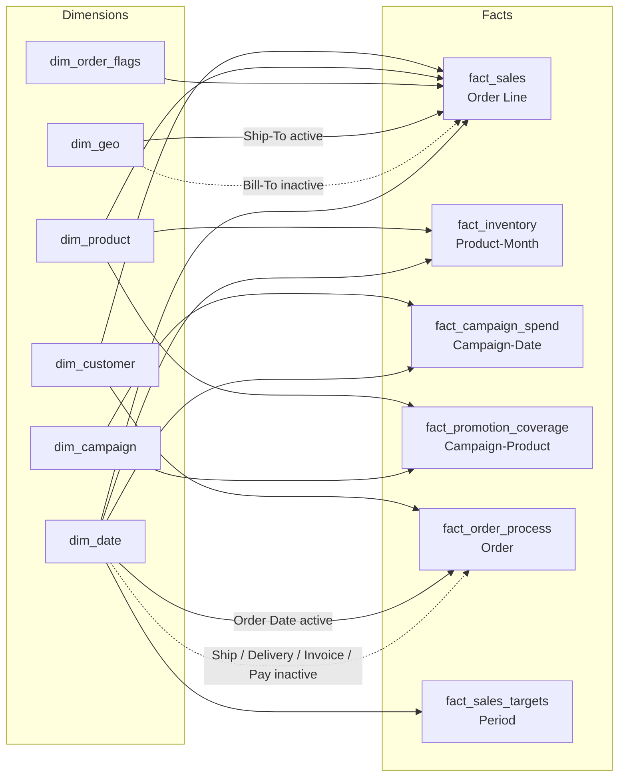
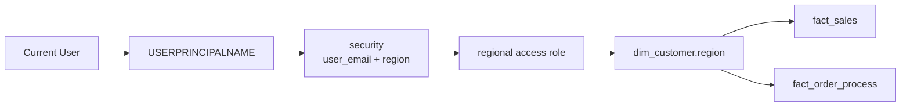
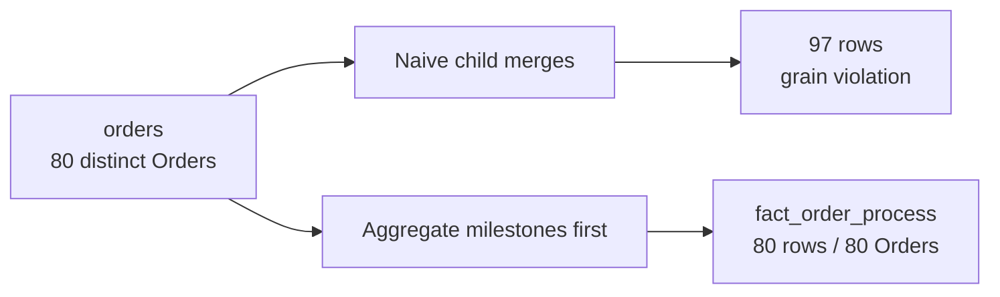

# Final Semantic Model — Validated Capstone

> Repository-native summary of the finalized PBIP/TMDL model. Runtime validation and the independent no-tutorial audit are complete.



The final analytical model contains no direct fact-to-fact relationship. Different business events remain separate facts and are compared through shared dimensions at compatible grains.

## Dynamic RLS path



Representative `View As` scenarios validated the expected Region-scoped behavior.

## Grain-safety QA



## Report proof

```text
Semantic model
→ _measures
→ Business Overview
   ├── Total Sales
   ├── Total Orders
   ├── Active Customers
   ├── Target Attainment
   ├── Sales Trend
   ├── Sales by Product Category
   ├── Sales by Customer Region
   └── Sales vs Target
```

## Technical note

Power BI Auto Date/Time local tables remain serialized. They are technical artifacts, not the intended business calendar. `dim_date` is the explicit analytical date dimension.