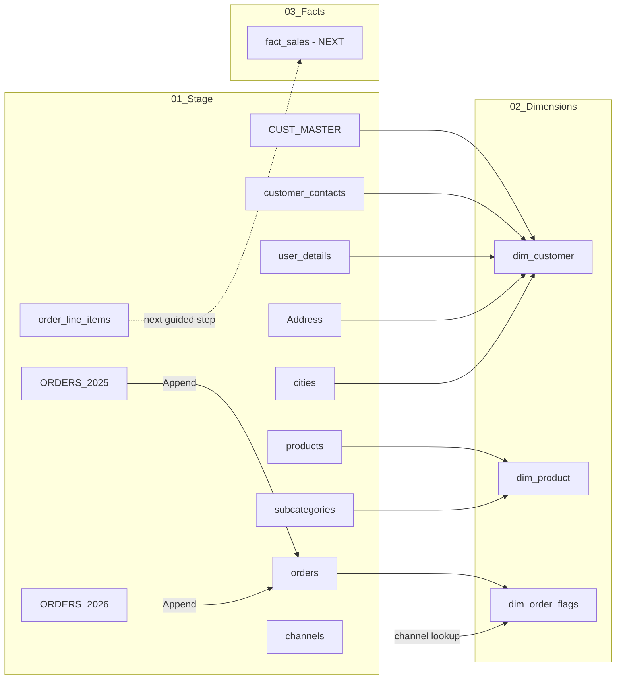

# Capstone Progress — Guided Model Build

> Evidence-backed project diagram synchronized with the committed PBIP/TMDL state at video checkpoint **03:45:58**.

## Current interpretation

- `dim_customer` consolidates fragmented customer/context sources into one analytical dimension.
- `dim_product` consolidates product and category/subcategory context and introduces `product_key`.
- `orders` removes the artificial yearly source split while preserving Order grain.
- `dim_order_flags` is a junk dimension at the grain of one unique channel/status/priority combination.
- `channels` is manually entered support data and therefore carries a maintenance/ownership caveat.
- `fact_sales` is shown with a dashed edge because it is the next guided step and **does not yet exist in the committed model at this checkpoint**.

This is a progress diagram, not the final target star/galaxy schema.