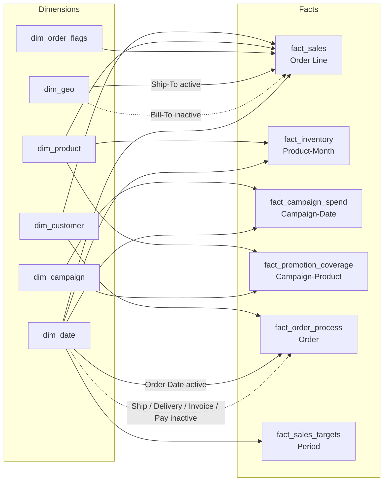
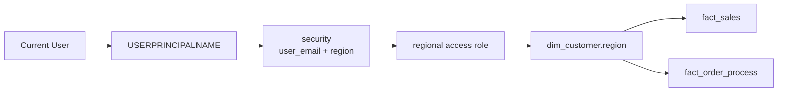
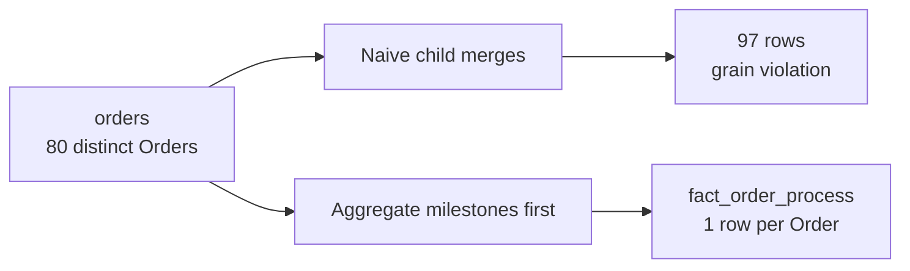

# Capstone Implementation Map — Current Model

> Repository-native summary of the current source-controlled guided implementation. Final runtime validation remains separate.

## Security path

## Grain-safety QA

## Known technical limitation

Power BI Auto Date/Time local tables are still serialized. `dim_date` is the intended analytical calendar; Auto Date artifacts are not represented as business dimensions in this diagram.