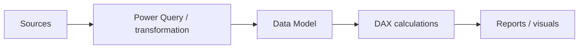
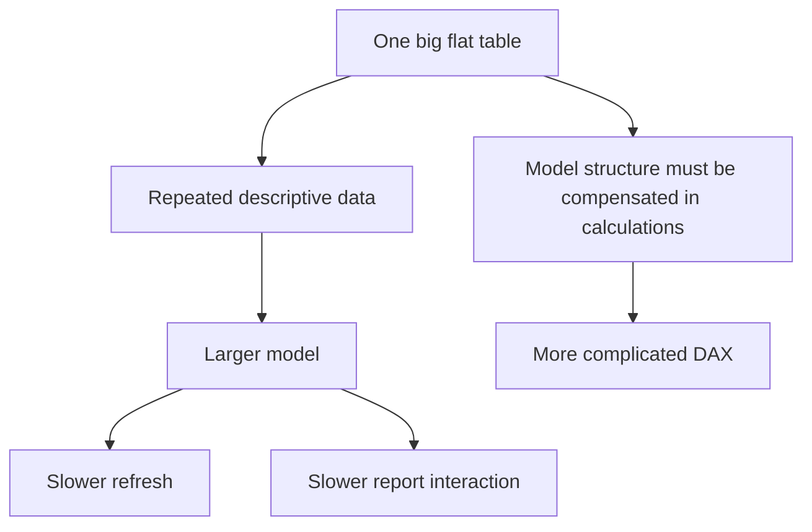
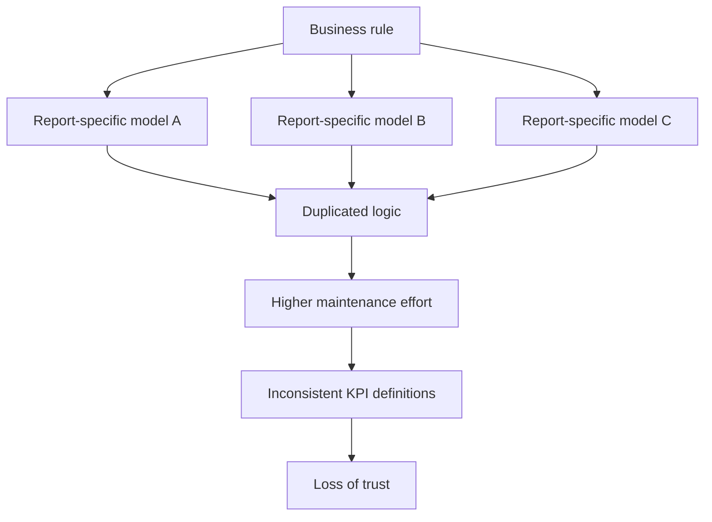
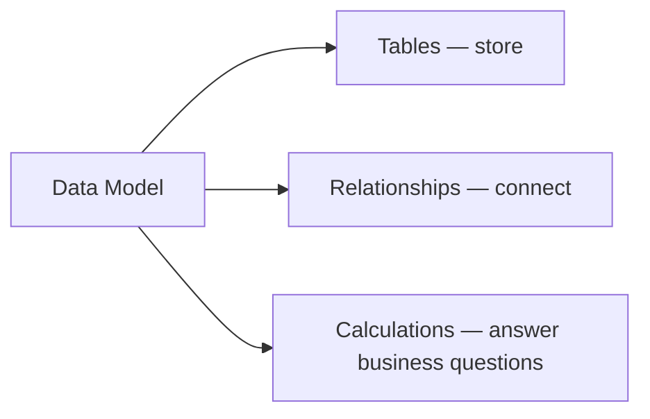
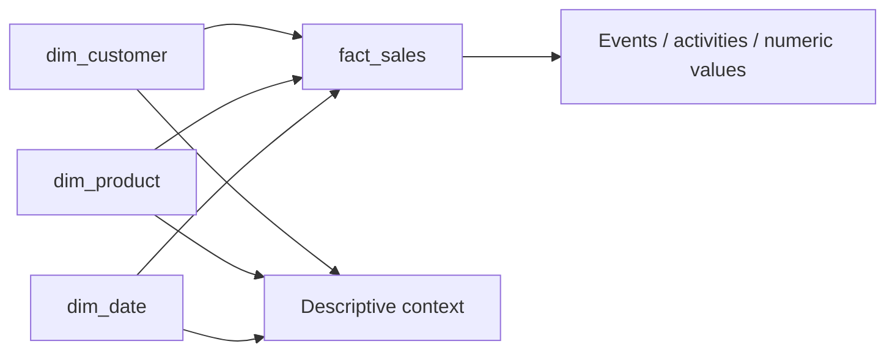

# Lesson 1 — Modeling Foundations

## Position of the data model

## Why the one-big-flat-table approach becomes problematic

## One table → one report problem

## Core data model components

## Fact and dimension roles

