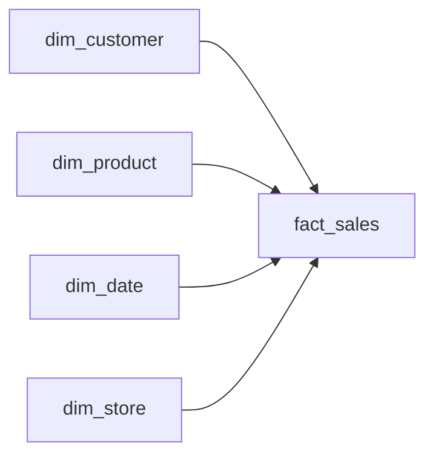
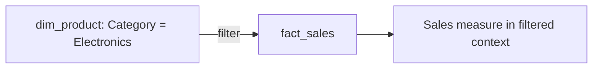
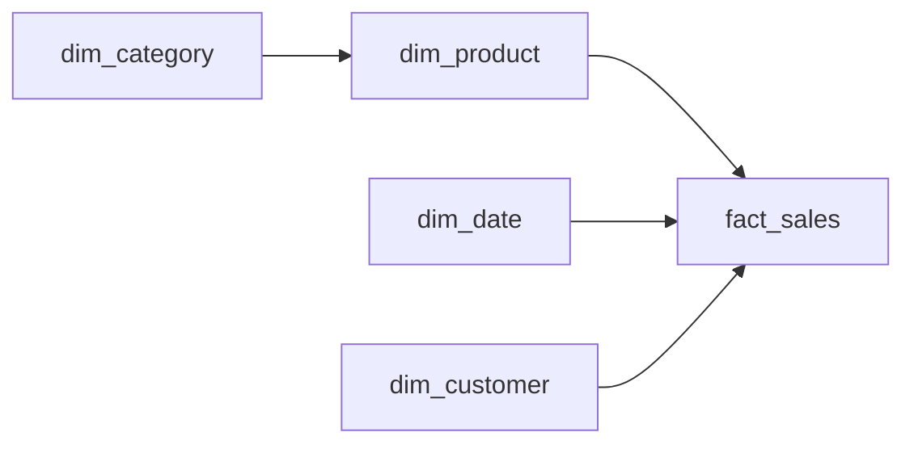
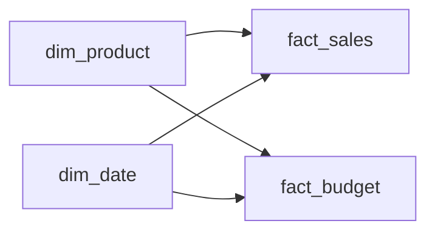

# Lesson 2 — Schema Patterns

## Star schema

**Course default:** facts in the center, dimensions around them.

## Filter propagation concept

## Snowflake schema

A dimension is split into additional dimension-level tables. This can reduce duplication/model size in some cases but introduces more relationships and longer filter paths.

## Galaxy schema

Multiple facts share common dimensions. Facts are not connected directly.
