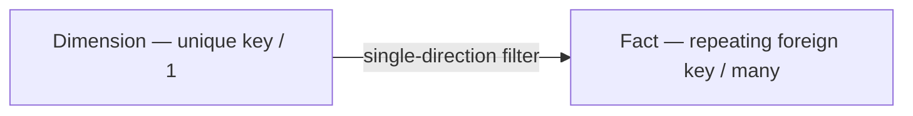
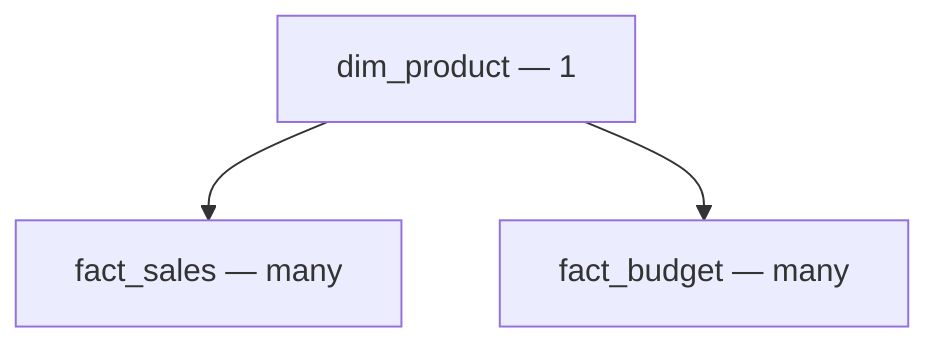
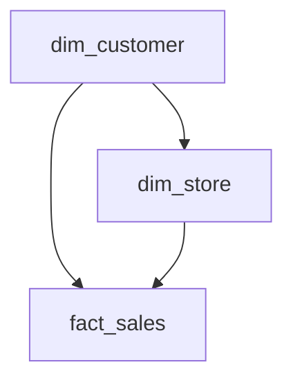
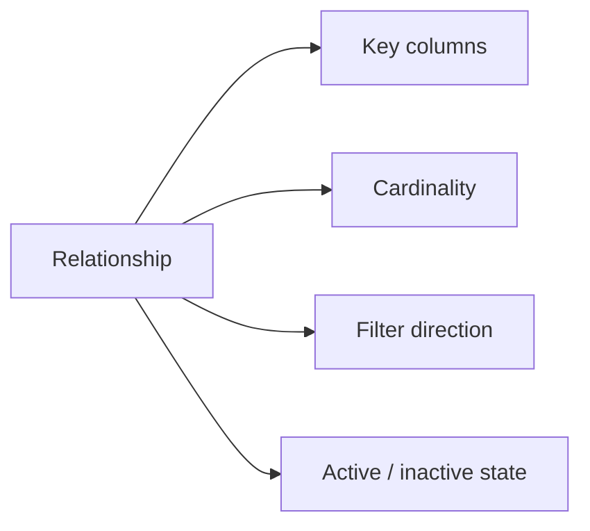

# Lesson 3 — Relationships

## Healthy star-schema relationship



## Shared dimension instead of direct fact-to-fact



Avoid:

```text
fact_sales  * -------- *  fact_budget
```

## Ambiguous filter paths



The customer can reach sales through more than one active route. The model must not leave competing active filter paths unresolved.

## Relationship contract


