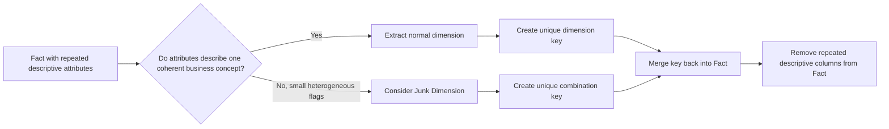
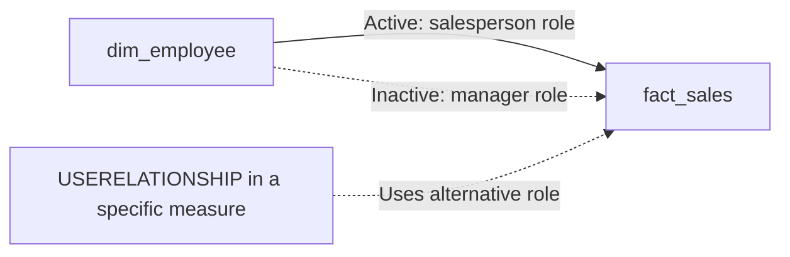
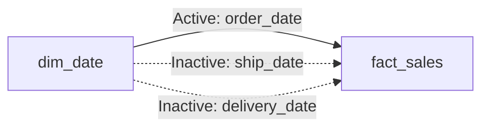

# Lesson 04 — Special Dimensions

Original Mermaid reconstruction of the concepts documented in `docs/theory/lesson_04_special_dimensions.md`.

## Extract dimensions hidden in facts

## Role-playing dimension

## Date role example

**Recall:** one dimension can represent multiple business roles. Alternative relationships can be semantically valid while inactive to preserve one unambiguous default filter path.