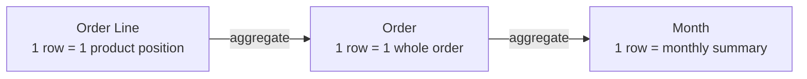
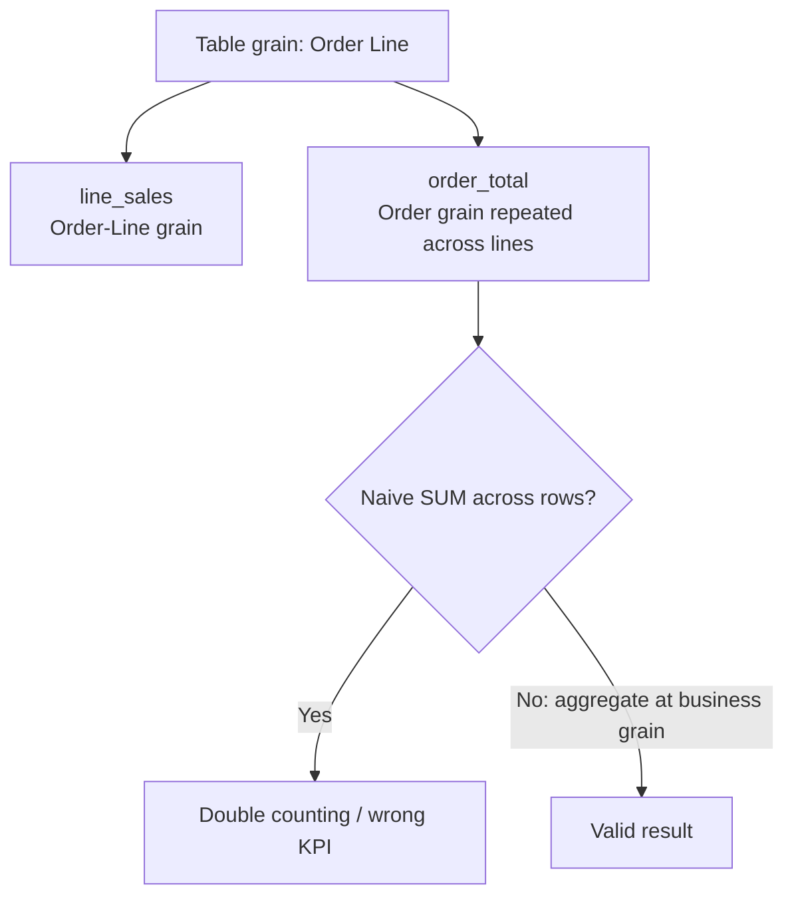
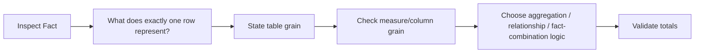

# Lesson 05 — Grain

Original Mermaid reconstruction of the Grain concepts documented in `docs/theory/lesson_05_grain.md`.

## Grain hierarchy

Order-Line grain is finer than Order grain.

## Table grain vs measure grain

## Grain-first workflow

**Recall:** do not combine or aggregate facts until their grain and the grain of important measures are understood.