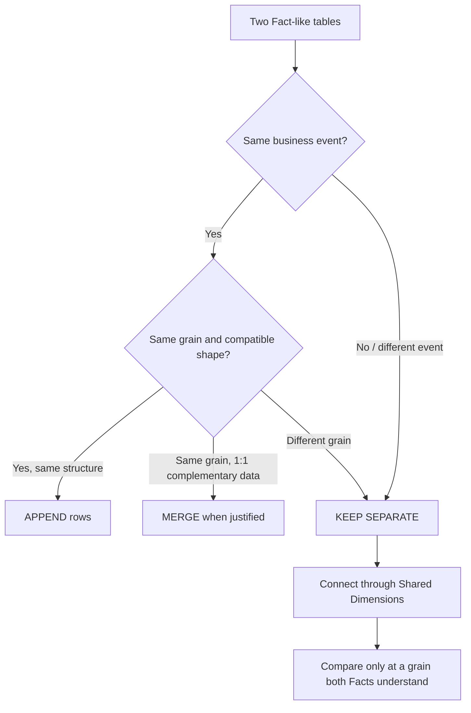
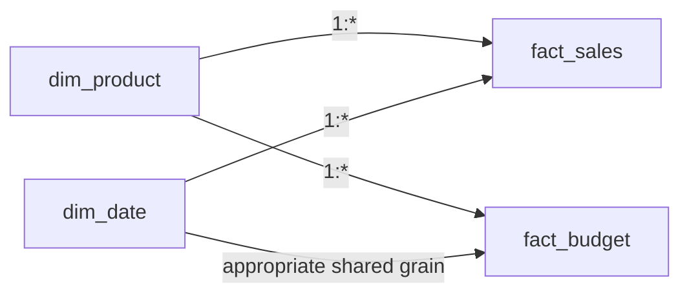
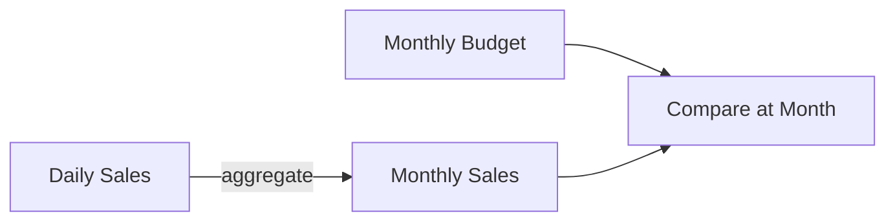

# Lesson 06 — Multiple Facts

Original Mermaid reconstruction of the multiple-fact decision logic documented in `docs/theory/lesson_06_multiple_facts.md`.

## Append / Merge / Separate decision

## Shared dimension pattern

## Common-grain comparison

**Do not:** directly connect two Facts through repeating keys, merge different-grain Facts and create fan-out, or invent detail below the grain where a measure was recorded.