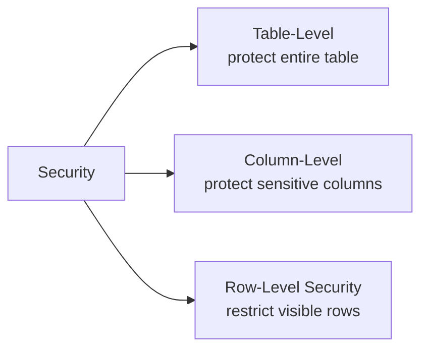
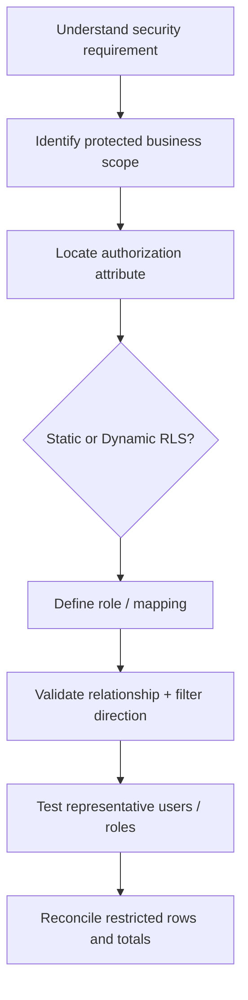

# Lesson 07 — Security and RLS

Original Mermaid reconstruction of the security concepts documented in `docs/theory/lesson_07_security_rls.md`.

## Security levels



## Dynamic RLS filter path

```mermaid
flowchart LR
    U[Current report user] --> P[USERPRINCIPALNAME]
    P --> Role[Dynamic role expression]
    Role --> Sec[Security / User mapping table]
    Sec -->|security filter| D[Dimension with authorization attribute]
    D -->|dimension filter| F[Fact table(s)]
```

## Security design workflow



## Security vs report filtering

```text
RLS           = What data may this user access at all?
Report filter = What allowed data does the user want to analyze now?
```

**Critical:** if the security filter cannot propagate from the security mapping through the model, RLS can fail and expose unintended data.