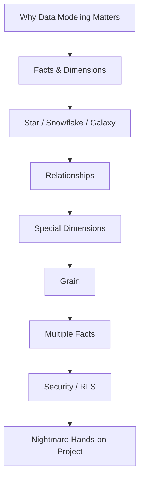
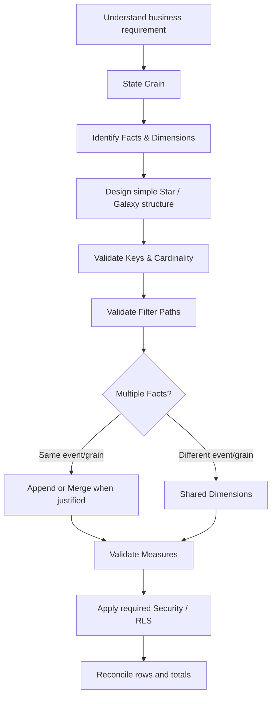

# Complete Theory Overview

This diagram summarizes the complete pre-project theory path documented in `docs/theory/`.



## Working model



## Completion boundary

```text
Theory lessons 1–7     ✅ complete
Active Recall          ✅ complete
Power BI capstone      ⬜ not started
Independent audit      ⬜ not started
```

The next step is implementation evidence, not additional theory consumption.