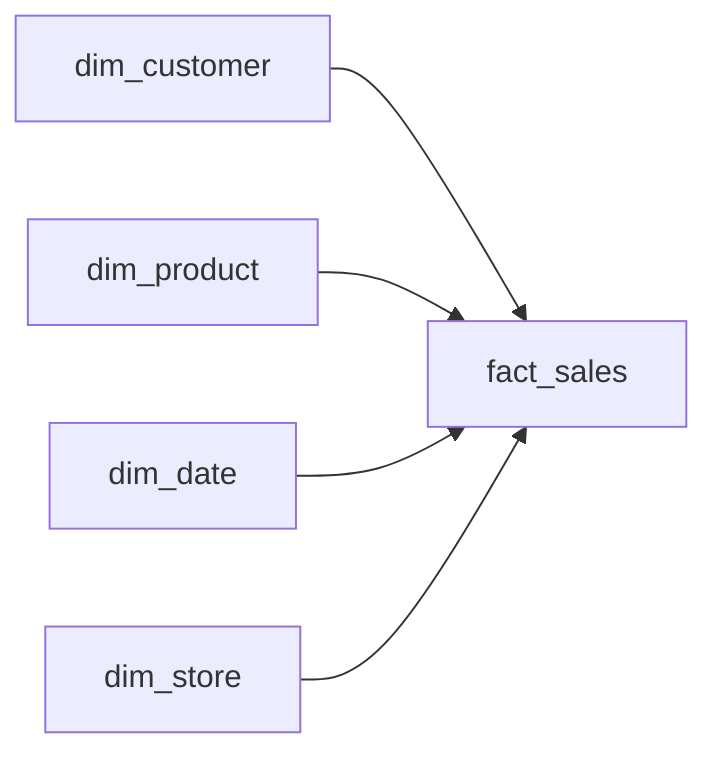
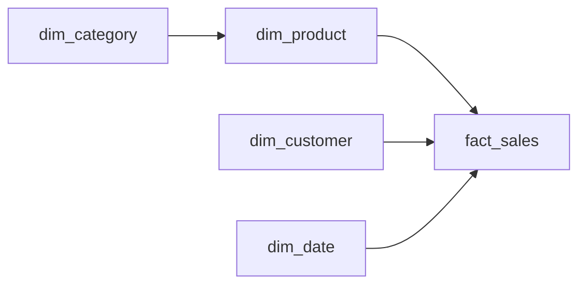
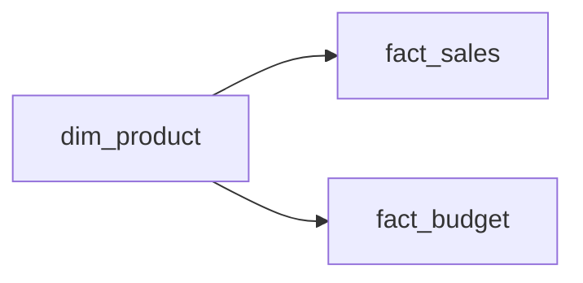

# Lesson 02 — Star, Snowflake and Galaxy Schemas

**Transcript range:** 00:18:36–00:27:42  
**Source:** Data with Baraa — Data Modeling in Power BI Full Course transcript

## 1. From facts and dimensions to a schema

Once facts and dimensions are understood, the next question is how to connect them.

The course introduces three schema patterns:

```text
Star Schema
Snowflake Schema
Galaxy Schema
```

The star schema is presented as the preferred default for Power BI.

## 2. Star Schema

A star schema places a fact table in the center and connects dimensions around it.



The visual shape resembles a star because the dimensions radiate around the central fact.

### Why Power BI works well with a star schema

The transcript emphasizes several reasons:

- the model has a clear filtering structure;
- dimensions provide context and filter the central fact;
- relationships tell Power BI how filter context should move;
- DAX can stay simpler because the relationship logic is already represented by the model;
- report authors can more easily identify where measures and descriptive fields belong.

The basic filter pattern is:

```text
DIMENSION
    ↓
RELATIONSHIP
    ↓
FACT
```

For example, filtering a product or customer dimension changes which sales rows are included in a result.

## 3. Measure by Context in a star schema

The fact/dimension distinction from Lesson 1 becomes operational in the star schema.

When creating a visual:

- numbers/measures normally come from the fact side;
- labels, grouping fields and slicers normally come from dimensions.

Example:

```text
Total Sales       → fact / measure
Product Category  → dimension
```

The model lets Product Category filter the relevant sales rows before the measure is aggregated.

## 4. Why relationships reduce calculation complexity

A clean star schema already expresses relationships such as:

```text
Product  → Sales
Customer → Sales
Date     → Sales
Store    → Sales
```

Because this structure exists in the model, DAX does not have to recreate all of the connection logic inside every measure.

This is a recurring course principle:

```text
Good model
→ model carries structural logic
→ calculations focus on the business metric
```

## 5. Snowflake Schema

A snowflake schema begins with the same fact-centered idea but splits one or more dimensions into additional related dimension tables.

Example:



Instead of all descriptive product information living in one product dimension, some attributes can be moved into another table such as Category.

### Why split a dimension?

The transcript describes an extreme case where a dimension becomes very large. Splitting it can reduce model size.

### Trade-off

The price of snowflaking is additional complexity:

- more relationships to manage;
- longer filter paths to reach the fact;
- calculations may need to account for the more complex structure;
- Power BI may have to traverse more tables;
- the model becomes harder to understand.

The course author's stated preference is therefore:

> Use a star schema by default and split dimensions only when there is a strong reason.

The source frames snowflake as a useful option, not as the automatically more advanced or more professional design.

## 6. Star versus Snowflake

| Concern | Star | Snowflake |
|---|---|---|
| Shape | Fact with dimensions directly around it | Dimensions may connect through sub-dimensions |
| Complexity | Lower | Higher |
| Relationships | Fewer | More |
| Filter path | Shorter | Potentially longer |
| Model size | Can be larger if dimensions are very wide/repetitive | Can reduce size in some cases |
| Course default | **Yes** | Only when justified |

The key decision is not "Which schema is theoretically more normalized?" but rather whether the added complexity produces a real benefit in the analytical model.

## 7. Galaxy Schema

Real analytical models can contain more than one fact table.

Example:

```text
fact_sales
fact_budget
```

Both facts may need the same business context, such as Product.

This produces a shared dimension:



A model with multiple fact tables sharing dimensions is described as a **galaxy schema**.

## 8. Shared Dimensions

A shared dimension gives multiple facts the same analytical context.

Example business question:

```text
Actual Sales vs Budget by Product
```

Both measures can be compared by Product because both fact tables connect to the same product dimension.

```text
             dim_product
              /       \
             /         \
     fact_sales       fact_budget
```

The same idea can apply to other shared dimensions such as Date.

## 9. Critical rule: no direct fact-to-fact relationship

The course explicitly warns against connecting fact tables directly.

Avoid:

```text
fact_sales ───── fact_budget
```

Prefer:

```text
fact_sales
     ↑
 dim_product
     ↓
fact_budget
```

The facts are related analytically through shared dimensions.

This rule becomes especially important later when the course covers multiple facts with different grains.

## 10. Semantic Model terminology

The course notes that Power BI terminology has evolved. Terms such as **Dataset**, **Semantic Model** and **Data Model** can refer to the model layer behind the report in this context.

The useful separation is:

```text
Semantic / Data Model
= tables + relationships + calculations

Report
= visual presentation on top of the model
```

## 11. Decision model

```text
Start with STAR
     │
     ├─ Dimension becomes exceptionally large and splitting has a clear benefit?
     │      └─ Consider SNOWFLAKE
     │
     └─ Multiple facts share analytical context?
            └─ Use SHARED DIMENSIONS → GALAXY
```

At every point:

```text
Never connect facts directly just because they share a column.
```

## 12. Failure modes from this lesson

- treating snowflake as automatically superior to star;
- creating unnecessary dimension-to-dimension chains;
- connecting fact tables directly;
- creating separate versions of the same dimension for every fact without a reason;
- forgetting that filter context should normally enter facts through dimensions.

## Active Recall

1. How is a star schema structured?
2. Why does the course treat star as the default Power BI pattern?
3. In the basic model, in which direction does filtering move?
4. Why can a good model simplify DAX?
5. What changes structurally when a star becomes a snowflake?
6. What benefit can snowflaking provide, and what costs does it add?
7. What is a galaxy schema?
8. What is a shared dimension?
9. Why should two fact tables not normally be connected directly?
10. What is the practical difference between the semantic/data model and the report layer?

## Learning status

- Theory documentation: ✅
- Lesson watched/studied: ✅
- Active Recall checkpoint: ✅
- Capstone implementation evidence: ⬜
