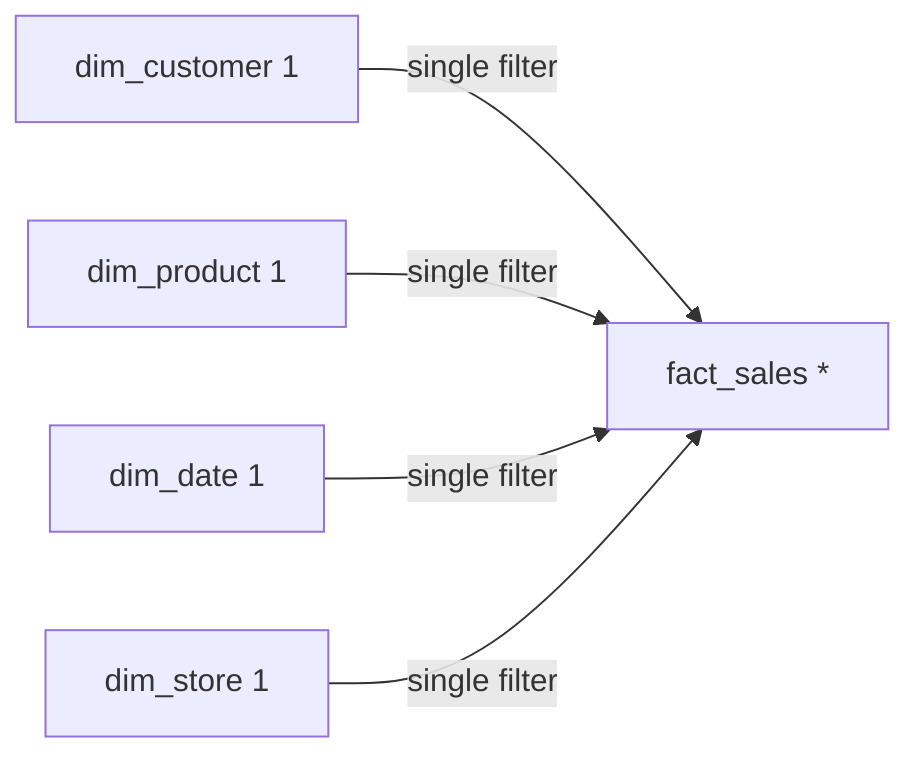

# Lesson 03 — Relationships

**Transcript range:** 00:27:43–01:07:37  
**Source:** Data with Baraa — Data Modeling in Power BI Full Course transcript

## 1. Why relationships matter

Relationships are not just visual lines between tables. They define how Power BI combines tables and how filters move through the model.

A model can still render visuals even when its relationships are wrong. That makes relationship mistakes dangerous because they can produce plausible-looking but incorrect numbers.

The course repeatedly treats this as a **silent error** risk:

```text
Wrong relationship logic
→ report still renders
→ numbers may look plausible
→ business receives incorrect results
```

## 2. Merge versus Relationship

The course distinguishes two ways to combine information from multiple tables.

### Merge in Power Query

A merge physically combines columns from two tables during data preparation.

```text
Table A + Table B
      ↓ Merge
Combined table
```

This is appropriate when the tables describe the **same business object / same row-level entity** and are better represented as one analytical table.

Example: two customer tables containing complementary customer attributes.

### Relationship in the model

A relationship keeps the tables separate and defines how they interact during analysis.

```text
Dimension ── relationship ── Fact
```

This is appropriate when the tables represent **different business roles**, such as a customer dimension and sales fact.

### Decision rule

```text
Same business object at compatible grain
→ consider MERGE

Different analytical objects / event vs context
→ RELATIONSHIP
```

## 3. Relationship as a contract

The course describes a relationship as a contract between tables. The contract tells Power BI:

- which columns match;
- how many matching values can exist on each side;
- how filter context is allowed to move;
- whether the relationship is active.

The core components are:

```text
Relationship
├── Keys
├── Cardinality
├── Filter direction
└── Active / inactive state
```

## 4. Keys

Power BI needs columns that identify how rows from the two tables correspond.

Example:

```text
dim_customer.customer_id
          ↓
fact_sales.customer_id
```

The dimension key should normally be unique for a one-to-many star-schema relationship, while the matching foreign key can repeat in the fact.

Without a meaningful matching key, the relationship does not represent a valid business connection.

## 5. Cardinality

Cardinality describes the uniqueness/repetition pattern of the relationship keys.

The course introduces four options:

```text
1 : 1
1 : *
* : 1
* : *
```

### ONE

`1` means the relationship key is unique on that side.

Example:

```text
dim_customer
customer_id
101
102
103
```

### MANY

`*` means values can repeat on that side.

Example:

```text
fact_sales
customer_id
101
101
102
103
103
```

## 6. One-to-Many — the star-schema default

The usual dimensional pattern is:

```text
DIMENSION 1 ───── * FACT
```

A customer appears once in the customer dimension but can appear many times in the sales fact because one customer can generate multiple sales events.

The same relationship read from the opposite direction is many-to-one:

```text
FACT * ───── 1 DIMENSION
```

These are the same relationship viewed from opposite sides.

## 7. One-to-One

A `1:1` relationship means the relationship key is unique in both tables.

The course treats this relationship as generally harmless for correctness, but it often raises a design question:

> If both tables describe the same business entity and have the same compatible grain, why keep them separate?

The course author's default is usually to merge them into one dimension because this:

- reduces the number of tables;
- reduces unnecessary traversal between tables;
- simplifies the star-schema shape.

### When a 1:1 split can still be justified

The transcript gives edge cases such as:

- a dimension becoming very wide and being split for manageability;
- sensitive attributes being separated for security reasons.

So the rule is not "1:1 is wrong." The rule is:

```text
1:1 + same business object
→ merge by default unless separation has a reason
```

## 8. Many-to-Many

A `*:*` relationship means the relationship key repeats on both sides.

The course treats this as a high-risk modeling pattern because there is no naturally unique dimension side to anchor the relationship.

A particularly dangerous case is a direct many-to-many relationship between two facts.

Avoid:

```text
fact_sales * ───── * fact_budget
```

Later lessons show how shared/bridge dimensions can provide a safer structure.

### Many-to-many is a signal to investigate

The presence of `*:*` should trigger questions such as:

- Is one side supposed to be a dimension but contains duplicates?
- Are two facts being connected directly?
- Is a bridge/shared dimension missing?
- Is the grain misunderstood?

## 9. Data quality controls cardinality

Cardinality is not only a modeling setting. It depends on the actual data.

If a product dimension is expected to contain one row per product but `product_id` appears twice, the dimension is no longer unique on that key.

```text
Expected:
product_id = 1,2,3,4,5,6

Actual:
product_id = 1,2,3,4,5,6,6
```

That duplicate can prevent the expected `1:*` relationship.

The course demonstrates fixing the underlying duplicate in Power Query rather than forcing an incorrect relationship setting.

This creates an important chain:

```text
Data quality
→ key uniqueness
→ cardinality
→ relationship behavior
→ report correctness
```

## 10. Automatic relationship detection

Power BI can automatically inspect loaded tables and create relationships based on factors such as matching columns and uniqueness.

This can be convenient in small models, but the course warns that in larger models automatic detection can create a confusing network of relationships that still needs manual review.

The modeler remains responsible for validating:

- the correct keys;
- the intended cardinality;
- filter direction;
- whether the relationship should exist at all.

## 11. Filter direction

Cardinality tells Power BI how many matching rows can exist. Filter direction tells Power BI **where filter context can travel**.

The course focuses on:

```text
Single
Both
```

## 12. Single-direction filtering

The preferred star-schema pattern is:

```text
DIMENSION
    ↓ filter
FACT
```

Example:

```text
dim_customer
    ↓
fact_sales
```

Selecting a customer filters the related sales rows.

This matches the analytical roles:

```text
Dimension = context / slicer / grouping
Fact      = measured events
```

## 13. Bidirectional filtering (`Both`)

With bidirectional filtering, context can travel in both directions.

```text
Dimension ↔ Fact
```

The course warns against using this casually because a filter can travel through the fact and begin influencing other dimensions.

Example:

```text
Customer ↔ Sales ↔ Store
```

A Customer filter can now indirectly change which Stores are visible.

This can produce unexpected behavior and more complicated filter networks.

The default recommendation is therefore:

> Use single direction from Dimension → Fact unless there is a deliberate reason for bidirectional filtering.

## 14. Ambiguity

Ambiguity occurs when Power BI has more than one active filter path between parts of the model.

Example:

```text
Customer ─────────────→ Sales
    │                     ↑
    └────→ Store ─────────┘
```

A Customer filter can reach Sales directly or via Store.

If those paths imply different filter results, Power BI cannot safely determine one unambiguous route.

The important principle is:

```text
One clear active filter path is preferable to multiple competing paths.
```

## 15. Active and inactive relationships

An **active relationship** participates automatically in normal filter propagation.

An **inactive relationship** exists in the model but is not used automatically.

Power BI displays these differently in the model view:

```text
solid line   = active
broken line  = inactive
```

Inactive relationships are not necessarily mistakes. They can be useful when:

- activating an additional relationship would create ambiguity;
- one dimension needs to play multiple roles against the same fact;
- a calculation intentionally needs an alternative relationship path.

The later role-playing-dimension section demonstrates this more explicitly.

## 16. Filter-direction discipline

A healthy star schema from the course generally looks like this:



The repeated pattern is:

```text
Dimension side = unique / ONE
Fact side      = repeating / MANY
Filter         = Dimension → Fact
```

## 17. Relationship review checklist

For every relationship, ask:

1. What business connection does this relationship represent?
2. Which columns form the key relationship?
3. Is the intended dimension key actually unique?
4. What is the cardinality?
5. Does filter direction follow the analytical intent?
6. Could bidirectional filtering create unintended filter propagation?
7. Is there more than one active path between these tables?
8. Should the tables actually have been merged instead?

## 18. Failure modes from this lesson

- accepting automatically detected relationships without review;
- forcing `1:*` when the supposed dimension contains duplicate keys;
- direct fact-to-fact many-to-many relationships;
- enabling `Both` simply because it makes a visual appear to work;
- leaving unnecessary 1:1 dimensions split without a reason;
- creating multiple active paths and ambiguity;
- assuming a rendered report proves the relationship design is correct.

## Active Recall

1. What is the difference between Merge and Relationship?
2. What four elements define the relationship contract?
3. What does `1` mean in cardinality?
4. What does `*` mean?
5. Why is `Dimension 1 → * Fact` the standard star-schema pattern?
6. When does the course suggest merging two 1:1 tables?
7. What are legitimate reasons to keep a 1:1 split?
8. Why should a many-to-many relationship trigger investigation?
9. How can a duplicate dimension key change relationship cardinality?
10. What is the default filter direction in the course?
11. Why can `Both` cause unexpected behavior?
12. What is ambiguity?
13. What is the difference between active and inactive relationships?
14. Why can an inactive relationship be intentional rather than broken?

## Learning status

- Theory documentation: ✅
- Lesson watched/studied: 🟡 in progress
- Active Recall checkpoint: ⬜
- Capstone implementation evidence: ⬜
