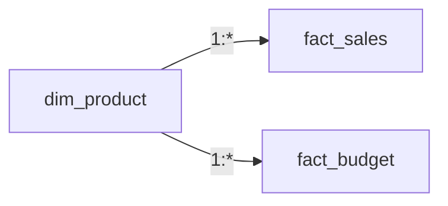

# Lesson 06 — Multiple Fact Tables

**Transcript range:** 01:41:28–02:08:57  
**Source:** Data with Baraa — Data Modeling in Power BI Full Course transcript

## 1. First rule: understand grain and business event

The course treats multiple-fact modeling as high risk because apparently convenient joins, merges or appends can create wrong numbers.

Before combining facts, state for each table:

```text
What business event does it represent?
What does one row represent?
What measures are recorded at that grain?
```

## 2. Same event + same grain + same/compatible structure → Append

Example:

```text
fact_sales_us
fact_sales_eu
```

If both represent the same Sales event at the same grain and have compatible columns, they are partitions of the same fact concept.

```text
fact_sales_us
      +
fact_sales_eu
      ↓ APPEND
  fact_sales
```

If the original table name contains useful provenance such as region/source, preserve it as a column before or during append.

Decision rule:

```text
same event + same grain + compatible shape
→ APPEND
```

## 3. Same grain + one-to-one complementary data → Merge when justified

If two tables describe the same row-level business entity/event and can be matched one-to-one, but contain complementary measures/attributes, keeping them separate can add unnecessary model complexity.

```text
Fact A: order_id + sales
Fact B: order_id + revenue
              ↓ MERGE
order_id + sales + revenue
```

The course warns against appending semantically different measures into one ambiguous generic `amount` column.

Decision rule:

```text
same grain + compatible 1:1 rows + complementary columns
→ MERGE side by side when justified
```

## 4. Different grain / different event → keep facts separate

Example:

```text
fact_sales   → detailed actual sales
fact_budget  → product-month budget plan
```

These facts describe different processes and levels of detail. They should not be blindly appended, merged or directly related through a repeating key.

## 5. Fan-out risk

Merging facts on a non-unique key such as `product_id` can create many-to-many row multiplication:

```text
many Sales rows
× many Budget rows
→ duplicated combined rows
→ inflated measures
```

This is the fan-out problem.

## 6. Avoid direct fact-to-fact many-to-many relationships

Avoid:

```text
fact_sales * ───── * fact_budget
```

A direct relationship between repeating keys does not create a clean analytical context and can lead to incorrect filtering or incomplete domains.

## 7. Shared / conformed dimension pattern

The course solves the different-fact problem through shared dimensions:



The shared dimension contains the complete Product domain and filters each fact independently.

This gives:

- correct dimension-driven filtering;
- no direct fact-to-fact dependency;
- products that exist in only one fact still remain available in the shared analytical domain.

The course uses terminology such as shared/bridge/conformed dimension in this context.

## 8. Build multi-fact visuals from shared dimensions

```text
Grouping / axis → shared dimension
Measure A       → Fact A
Measure B       → Fact B
```

Do not use one fact table as the master descriptive list for another fact.

## 9. Compare facts only at a grain both understand

A measure can be shown at the grain where it was recorded or at a more aggregated level. It cannot truthfully be pushed to a lower/finer grain that does not exist in the source.

Examples:

```text
Sales = daily
Budget = monthly
→ aggregate Sales to Month
→ compare at Month
```

```text
Sales = Product grain
Budget = Category grain
→ compare at Category
→ do not invent Product-level Budget
```

The common comparison grain is the lowest/final level both facts can validly support.

## 10. Validation pattern

To validate a combined multi-fact visual:

1. calculate/view Fact A independently;
2. calculate/view Fact B independently;
3. build the shared-dimension visual containing both measures;
4. verify that each fact's totals remain consistent.

```text
Combined model totals
must reconcile to
standalone Fact A + standalone Fact B baselines
```

## 11. Decision framework

```text
TWO FACT TABLES
      │
      ├─ Same event + same grain + compatible shape?
      │      └─ APPEND
      │
      ├─ Same grain + one-to-one complementary data?
      │      └─ MERGE when justified
      │
      └─ Different grain / event?
             ├─ keep separate
             ├─ no direct fact-to-fact relationship
             └─ connect through shared dimensions
```

For reporting:

```text
Compare only at a grain both facts understand.
```

## 12. Failure modes

- relating facts directly because they share a key name;
- merging many-to-many facts and multiplying rows;
- appending semantically different measures into a generic amount field;
- using one fact's keys/descriptions as the axis for multiple facts;
- losing source provenance during append;
- forcing a measure below the grain where it was recorded;
- comparing daily Sales with monthly Budget at Day level;
- checking only grand totals and ignoring breakdown-level reconciliation.

## Active Recall checkpoint — 2026-09-01

**Status: completed.**

Correctly recalled:

- same event + same grain + compatible structure → Append;
- same grain + complementary one-to-one data → Merge when justified;
- different grain/event → keep facts separate and use shared dimensions;
- direct fact-to-fact relationships through repeated keys should be avoided;
- comparisons occur at a common valid grain;
- daily Sales can be aggregated to Month for comparison with monthly Budget;
- monthly Budget cannot be treated as daily without an explicit allocation assumption.

## Learning status

- Theory documentation: ✅
- Lesson watched/studied: ✅
- Active Recall checkpoint: ✅
- Capstone implementation evidence: ⬜ not started