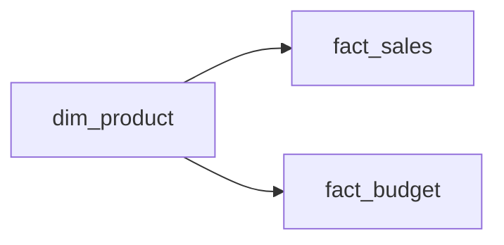
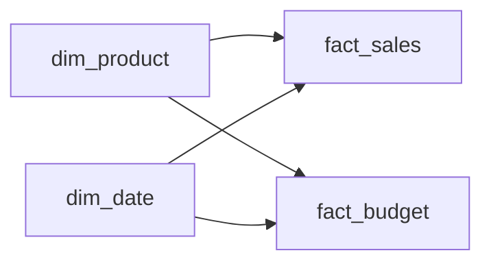

# Lesson 06 — Multiple Fact Tables

**Transcript range:** 01:41:28–02:08:57  
**Source:** Data with Baraa — Data Modeling in Power BI Full Course transcript

## 1. Why multiple facts are difficult

The course calls multiple-fact modeling one of the most confusing areas because several tempting solutions can produce wrong numbers:

- directly relate two facts because they share a column;
- merge them without checking grain;
- append them because the shapes look similar.

The first rule is therefore the same as in the Grain lesson:

> Before combining facts, state the grain of each fact and understand the business event each table represents.

The course then evaluates several scenarios.

---

## 2. Scenario A — Same grain, same event, same structure

Example:

```text
fact_sales_us
fact_sales_eu
```

Both tables represent:

```text
one row = one order
```

They also contain the same type of event and the same structure. The only reason for separation is source-side partitioning such as region, country, year or operational management.

### Correct pattern: Append

A relationship between the tables is unnecessary because they represent the same thing. A merge is also inappropriate when the rows do not match one-to-one by key.

The source recommends stacking the rows:

```text
fact_sales_us
      +
fact_sales_eu
      ↓ append
 fact_sales
```

### Preserve source information

Appending can lose information that was encoded only in the original table name. The course therefore recommends adding a source attribute before/while appending.

Example:

```text
source = US
source = EU
```

Decision rule:

```text
Same grain
+ same event
+ same structure
→ APPEND
```

---

## 3. Scenario B — Same grain, different attributes/events, one-to-one correspondence

Example:

```text
fact_sales
fact_revenue
```

Both have:

```text
one row = one order
```

but they contain different measures or event attributes.

The source notes that a one-to-one relationship is possible, but if both facts have the same grain and can be matched row-for-row, keeping them separated adds unnecessary complexity.

### Avoid appending unlike measures into one generic amount column

Appending tables that are not actually identical can produce a structure such as:

```text
order_id | measure_type | amount
```

where one row's `amount` means Sales and another row's `amount` means Revenue.

A careless aggregation over `amount` then mixes different business meanings.

### Preferred pattern: Merge side by side

The course prefers:

```text
order_id | customer | sales | revenue
```

This keeps each measure semantically separate and makes aggregation safer.

Decision rule:

```text
Same grain
+ compatible one-to-one rows
+ different columns / measures
→ MERGE into one fact
```

---

## 4. Scenario C — Different grain, different event

Example:

```text
fact_sales
one row = one order / detailed sales event

fact_budget
one row = one product-month budget plan
```

The two facts describe different processes and different levels of detail.

The business may still ask for a comparison such as:

```text
Actual Sales vs Budget by Product
```

This is where the course strongly warns against both merging and direct relationships.

## 5. Why merging different-grain facts fails

Suppose both facts contain `product_id`. It may look possible to merge on Product.

But one Product can appear many times in Sales and many times in Budget.

The effective matching is many-to-many:

```text
fact_sales  *  ↔  *  fact_budget
```

A merge can multiply rows and duplicate measures. A budget amount can be repeated once for every matching sales row, creating inflated totals.

This is the **fan-out** problem demonstrated in the course.

```text
Many matching rows on left
× many matching rows on right
→ duplicated combined rows
→ inflated aggregates
```

## 6. Why a direct fact-to-fact relationship also fails

Keeping the two facts separate but connecting them directly through `product_id` still creates a many-to-many relationship.

Two problems appear in the course example:

### 6.1 Incorrect totals / fan-out behavior

The many-to-many relationship can propagate measure context in ways that duplicate values.

### 6.2 Incomplete analytical domain

If the visual axis comes from one fact, it only contains entities present in that fact.

Example:

- a future product may have Budget but no Sales yet;
- another product may have Sales but no Budget.

If the report uses Product values from `fact_sales`, products existing only in Budget disappear from the visual.

A fact table should not be used as the master descriptive list for a shared business entity.

## 7. Shared / Bridge / Conformed Dimension

The course solves different-grain fact comparison by introducing a separate dimension containing the full business domain.

For Product:



The transcript uses terms such as **shared dimension**, **bridge dimension**, and **conform/conformed dimension** in this context.

The dimension has one unique row per Product and connects to both facts through one-to-many relationships.

This gives two benefits:

1. **Completeness:** the dimension contains the full set of products, including products that currently exist in only one fact.
2. **Correct aggregation:** each fact remains at its native grain and is filtered independently by the common dimension.

## 8. Building visuals from shared dimensions

The course recommends starting the grouping/axis from the shared dimension and then taking measures from the separate facts.

```text
Axis / grouping → dim_product
Measure 1       → fact_sales
Measure 2       → fact_budget
```

This is different from using Product directly from either fact.

The general pattern is:

```text
Shared business context from dimension
+ measures from facts
```

## 9. Validate multi-fact visuals

The course demonstrates a practical validation technique:

1. Build one combined visual using the shared dimension and both measures.
2. Build a separate visual for Fact A only.
3. Build a separate visual for Fact B only.
4. Compare totals between the dedicated and combined views.

```text
Combined result
must preserve
Fact A standalone total
and
Fact B standalone total
```

This is an early form of metric reconciliation.

## 10. Multiple shared dimensions

Two facts can share more than one dimension.

The transcript extends the Sales/Budget example with Date:



This allows comparisons by multiple common dimensions as long as the grain constraints are respected.

## 11. Comparing facts with different dimensional detail

The most advanced scenario in the lesson occurs when two facts share only a **higher-level** dimension.

Example:

```text
Sales recorded by Product
Budget recorded only by Category
```

The business asks:

```text
Sales vs Budget by Product
```

But Budget does not exist at Product grain.

The course gives a strict rule:

> A measure can be shown at the grain where it was recorded or at a higher/more summarized level — not at a lower/more detailed level that does not exist in the source.

Therefore:

```text
Budget at Category grain
→ valid at Category
→ valid at higher summary / total
→ not valid at Product detail
```

A tool cannot truthfully invent Product-level budget values when the budget was never recorded by Product.

## 12. Highest common grain for comparison

When two facts have different grains, compare them at the highest level that both understand.

Example:

```text
Sales: day-level dates
Budget: month-level dates
```

A daily visual cannot meaningfully align Budget with Sales because Budget is only monthly.

The correct comparison is rolled up to Month:

```text
Sales → aggregate to month
Budget → already month
→ compare side by side
```

Likewise:

```text
Sales by Product
Budget by Category
→ compare at Category, not Product
```

## 13. Complete decision framework from the transcript

```text
TWO FACT TABLES
      │
      ├─ Same grain + same event + same structure?
      │      └─ APPEND
      │         Preserve source metadata if needed
      │
      ├─ Same grain + one-to-one rows + different measures/shape?
      │      └─ MERGE side by side
      │
      └─ Different grain / different event / different shape?
             ├─ Do NOT append
             ├─ Do NOT merge
             ├─ Do NOT connect facts directly
             └─ Keep separate + connect through shared dimension(s)
```

For reporting:

```text
Compare measures only at a level both facts understand.
```

## 14. Failure modes from this lesson

- relating two facts directly because they share a column name;
- merging many-to-many facts and creating row multiplication;
- appending different measures into one ambiguous amount column;
- using one fact's descriptive key values as the report axis for multiple facts;
- losing source provenance when appending partitioned facts;
- forcing a measure below the grain at which it was recorded;
- comparing daily Sales to monthly Budget at day level;
- checking only grand totals and ignoring breakdown-level correctness.

## Active Recall

1. When should two facts be appended?
2. Why should source information often be preserved during append?
3. When does the course recommend merging two facts?
4. Why can appending Sales and Revenue into a generic `amount` column be dangerous?
5. What happens when different-grain facts are merged on a non-unique shared key?
6. Why is a direct fact-to-fact many-to-many relationship problematic?
7. What problem does a shared/conformed dimension solve?
8. Why should the visual axis come from the shared dimension rather than one fact?
9. How can you validate that a combined multi-fact visual has not changed the totals?
10. What is the rule for showing a measure at a lower grain than where it was recorded?
11. If Sales are daily and Budget is monthly, at what level should they be compared?
12. If Sales exist by Product but Budget only by Category, what is the lowest valid comparison level?

## Learning status

- Theory documentation: ✅
- Lesson watched/studied: ⬜
- Active Recall checkpoint: ⬜
- Capstone implementation evidence: ⬜
